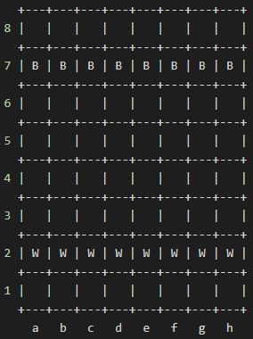

# hyperskill-pawns-only-chess
Pawns-Only Chess for the JetBrains Academy project.

There is an example of a chess board you're going to see:

First, the program will ask players for their names. After that, the software will prompt each player to take turns and make a move.

The correct input format should follow the x1y1x2y2 format where x1y1 is the coordinates of a pawn that the user wants to move, and x2y2 are the coordinates of the final position. For example, the valid moves are a2a4, d4e5, a7a6, and so on. Moves like j2j4, h0h4, a2a4a are deemed to be invalid.
If a player prompts an invalid move, the game will print a warning and ask for another move.

The program will terminate after the exit command or when the game is over.

The game is over when either player succeeds in moving their pawn to the last opposite rank — rank 8 for White, rank 1 for Black. The game is also over when all opposite pawns are captured.

Stalemate (draw) occurs when a player can't make any valid move on their turn.
